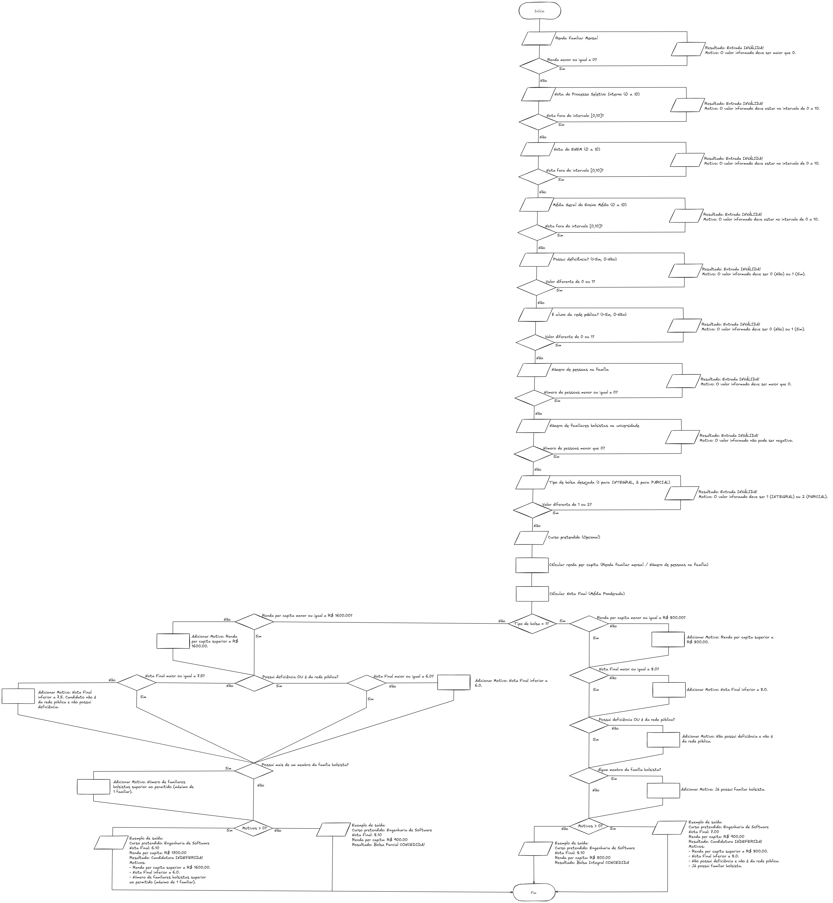

# Sistema de Bolsa de Estudos

Este sistema implementado em C permite avaliar a elegibilidade de candidatos para bolsas universitárias (integral ou parcial) com base em critérios socioeconômicos e acadêmicos.

## Funcionalidades
- Cálculo da renda per capita.
- Cálculo da nota final do candidato.
- Validação dos critérios de elegibilidade para bolsas integrais e parciais.
- Exibição do resultado da candidatura com motivo de aprovação ou reprovação.

## Fluxograma
- O fluxo de execução do sistema pode ser visualizado no fluxograma abaixo:



O fluxograma foi criado usando Excalidraw. O arquivo fonte original (.excalidraw) está disponível em `docs/flowchart-university-scholarship-work.excalidraw` e pode ser editado usando a ferramenta online [Excalidraw](https://excalidraw.com/).

## Critérios para Bolsa
### Bolsa Integral
- Renda per capita máxima de R$800,00.
- Nota final mínima de 8.0.
- Ser estudante da rede pública ou possuir deficiência.
- Não ter familiares já bolsistas na universidade.

### Bolsa Parcial
- Renda per capita máxima de R$1600,00.
- Nota final mínima de:
  - 6.0 para estudantes da rede pública ou com deficiência.
  - 7.5 para demais candidatos.
- No máximo 1 familiar bolsista na universidade.

## Como Executar
1. Compile o código usando um compilador C, como o GCC:
   ```sh
   gcc -o bin/scholarship_eval src/main.c
   ```
2. Execute o programa:
   ```sh
   ./bin/scholarship_eval
   ```

## Autor
Desenvolvido por Gabriel Campos.

